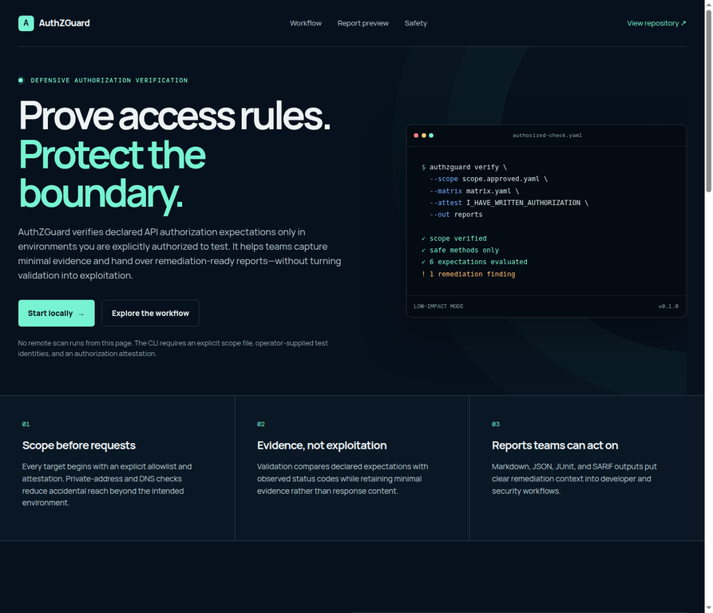

# AuthZGuard

> **Authorization regression testing for API environments you are explicitly authorized to assess.**

AuthZGuard verifies a **declared** authorization matrix against a deliberately approved API target. It is designed for application-security teams, platform engineers, and authorized security researchers who need low-impact evidence that an API returns the expected authorization boundary for a known identity and route.

## Project preview



**[Open the interactive project guide](https://9gkc.github.io/AuthZGuard/)** for an overview of the scope-first workflow and reporting model. The guide is presentation-only: it does not send requests, store credentials, or scan a remote system.

## Responsible-use boundary

AuthZGuard is not an exploitation framework, crawler, credential harvester, or public-target discovery tool. It deliberately limits network checks to `GET`, `HEAD`, and `OPTIONS`; requires an explicit, machine-readable scope; requires a written-authorization attestation; records no response bodies; and blocks public targets unless the scope and command line both opt in. **Do not use it against a system, account, tenant, or endpoint without written authorization from the system owner.**

| Capability | Included | Explicitly excluded |
|---|---:|---:|
| Verify declared authorization expectations | Yes | No inferred permissions |
| Local or approved staging tests | Yes | No target discovery |
| Safe HTTP methods | `GET`, `HEAD`, `OPTIONS` | `POST`, `PUT`, `PATCH`, `DELETE` |
| Evidence | Status, URL, identity label, content type | Response bodies, tokens, secrets |
| Reports | Markdown, JSON, JUnit, SARIF | Automated exploitation or remediation deployment |

## Quick start: local training service

The included service is intentionally local-only and has no production credentials or data.

```bash
python examples/training_api.py
```

In a second terminal, validate the documents before any request is sent:

```bash
authzguard validate \
  --scope examples/scope.local.yaml \
  --matrix examples/matrix.local.yaml \
  --openapi examples/openapi.local.yaml
```

Then run the local checks:

```bash
authzguard verify \
  --scope examples/scope.local.yaml \
  --matrix examples/matrix.local.yaml \
  --openapi examples/openapi.local.yaml \
  --attest I_HAVE_WRITTEN_AUTHORIZATION \
  --out reports
```

The command writes `authzguard.md`, `authzguard.json`, `authzguard.junit.xml`, and `authzguard.sarif`. A non-zero exit code indicates that one or more **declared** expectations needs review; it is not proof of a vulnerability by itself.

## Required operator inputs

The scope document binds work to a written authorization reference and explicit targets. A target cannot be reached merely because it appears in an authorization matrix.

```yaml
authorization:
  attestation: I_HAVE_WRITTEN_AUTHORIZATION
  reference: "CHANGE-1234 / written authorization held by the operator"
targets:
  - base_url: https://staging.example.test
    allow_authorized_public_target: true
    allow_private_network: false
```

The matrix contains only routes and identities that the operator has prepared and approved. Credentials are read from environment variables; never place tokens in YAML, commits, issue comments, or reports.

```yaml
identities:
  analyst: AUTHZGUARD_ANALYST_TOKEN
  anonymous: null
checks:
  - id: analyst-cannot-read-admin-export
    target: https://staging.example.test
    method: GET
    path: /v1/admin/export
    identity: analyst
    expected_statuses: [401, 403]
    rationale: "The analyst role is not assigned the export permission."
```

For an explicitly authorized public staging target, both protections are required: `allow_authorized_public_target: true` in the committed scope, and `--permit-authorized-public-targets` in the command. HTTP is rejected for non-local targets and private targets require a separate explicit scope switch.

## Workflow

| Step | Operator action | AuthZGuard action |
|---|---|---|
| 1. Authorize | Obtain written scope and a reference ID. | Requires the reference and attestation. |
| 2. Declare | Define approved targets, test identities, expected statuses, and rationale. | Validates structure before requests. |
| 3. Verify | Run only against approved local or staging infrastructure. | Sends only rate-conscious safe-method requests. |
| 4. Review | Assess unexpected status codes with the system owner. | Emits minimal evidence and remediation-focused reports. |
| 5. Remediate | Fix policy, middleware, route guard, or access rule. | Re-run the same declared checks as a regression control. |

## GitHub Action

`action.yml` is intentionally **validation-only**. It validates scope, matrix, and optional OpenAPI route declarations during pull requests without contacting an API target.

```yaml
- uses: 9gkc/AuthZGuard@main
  with:
    scope: examples/scope.local.yaml
    matrix: examples/matrix.local.yaml
    openapi: examples/openapi.local.yaml
```

Run network checks only in a controlled CI environment where the workflow owner has configured approved staging credentials, target permission, and artifact handling. Do not run a network verification from forked pull requests.

## Reporting and remediation

An unexpected status code should be treated as a **review signal**, not as permission to access or retrieve more data. Preserve the minimal report, stop at the declared evidence threshold, notify the system owner according to the agreed process, and document a remediation path such as server-side ownership checks, deny-by-default middleware, role-permission review, route-level authorization, or regression tests.

See [SECURITY.md](SECURITY.md) for reporting a vulnerability in AuthZGuard itself, and [docs/RESPONSIBLE_USE.md](docs/RESPONSIBLE_USE.md) for the complete use policy.

## Development

```bash
python -m pip install -e .
python -m unittest discover -s tests -v
```

## License

MIT. See [LICENSE](LICENSE).
